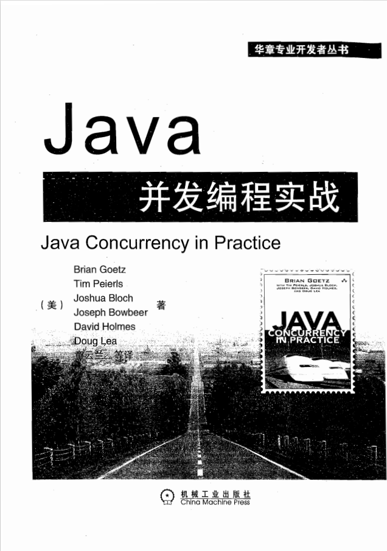

# JavaConcurrencyInPractice
Java并发编程实战 Brian Goetz. 代码+笔记+电子书

## 如何使用本书
为了解决在 Java 底层机制与设计级策略之间的不匹配问题，我们给出了一组简化的并发程序编写规则。专家看到这些规则会说:“嗯，这并不是完整的规则集。即使类C违背了规则R, 它仍然是线程安全的。”虽然在违背一些规则的情况下仍有可能编写出正确的并发程序，但这需要对 Java 内存模型的底层细节有着深人的理解，而**我们希望开发人员无须握这些细节就能编写出正确的并发程序。只要始终遵循这组简单的规则，就能编写出正确的并且可维护的并发程序。**

我们假设读者对 Java 的基本并发机制已经有了一定程度的了解。本书并非是对并发的入门介绍一-要了解这方面的内容，请参考其他书籍中有关线程的内容，例如《The JavaProgramming Language》(Arnold等，2005)。此外，本书也不是介绍并发的百科全书--要了解这方面的内容，请参考《Concurrent Programming in Java》(Lea，2000)。**事实上，本书提供了各种实用的设计规则，用于帮助开发人员创建安全的和高性能的并发类。** 在本书中相应的地方引用了以下书籍中的相关章节:《The Java Programming Language》《Concurrent Programmingin Java》、《The Java Language Specification》( Gosling 等，2005 )以及《Effective Java 》(Bloch2001)，并分别使用[JPLn.m]、[CPJ n.m]JLS m]和[EJ tm n] 来表示它们。

### 章节概要
在进行简要的介绍(第1章)之后，本书共为四个部分:基础知识。
**第一部分(第2章~第5章)**: 重点绍了发性和安全性的基本概念，以及如何使用类库提供的基本并发构建块来构建线程安全类。在第一部分给出了一个清单，其中总结了这一部分中介绍的最重要的规则。

第 2章与第 3 章构成了本书的基础。在这两章中给出了几乎所有用于**避免并发危险、构造线程安全的类以及验证线程安全的规则**。如果读者重“实践”而轻“理论”，那么可能会直接跳到第二部分，但在开始编写任何并发代码之前，一定要回来读一读这两章!

第4章介绍了如何将一些小的线程安全类组合成更大的线程安全类。第5绍了在平台库中提供的一些基础的并发构建模块，包括线程安全的容器类和同步工具类。

**结构化并发应用程序。第二部分(第6章~第9章)**: 介绍了如何用线程来提高并发应用序的吞吐量或响应性。第6章介绍了如何识别可并行执行的任务，以及如何在任务执行框架中执行它们。第 7章介绍了如何使任务和线程在执行完正常工作之前提前结束。在健壮的并发应用程序与看似能正常工作的应用程序之间存在的重要差异之一就是: 如何实现取消以及关闭等操作。第8 章介绍了任务执行框架中的一些更高级特性。第9章介绍了如何提高单线程子系统
的响应性。

**活跃性、性能与测试。第三部分(第10~第12章)**: 介绍如何并发执行预期的任务，以及如何获得理想的性能。第 10 章介绍了如何避免一些使序无法执行下去的活跃性故障。第 11 章介绍了如何提高并发代码的性能和可缩性。第 12章介绍了在测试并发代码的正确性和性能时可以采用的一些技术。

**高级主题。第四部分(第13章~第16章)**: 绍资深开发人员可能感兴趣的一些题包括:显式锁、原子变量、非阻塞算法以及如何开发自定义的同步工具类。

## 项目概述
code 是代码文件夹, 按照如上所述分成了4个section, 并按章节组织了其中的代码

docs 则为笔记文件夹, 文件夹结构扁平式, 仅按章节组织了阅读笔记, 其标准是仅依据笔记就能获取到关键知识点并复现相关程序.

另外, 项目还给出了电子书

### 阅读进度
序号|章节|页数|是否完成|完成日期
:-|:-:|:-:|:-:|:-:|
1|5.1 ~ 5.4|(p66-p78)|[Y]|23-09-23
2|5.5 ~ 5.6|(p78-p92)|[]|
3|7.1 ~ 7.2|(p111-p131)|[]|
5|7.3 ~ 8.5|(p132-p155)|[]|
6|10.1 ~ 11.2|(p169-p189)|[]|
7|11.3 ~ 12.1|(p189-p214)|[]|
8|12.2 ~ 12.4|(p215-p226)|[]|
9|13.1 ~ 14.1|(p227-p243)|[]|
10|14.2 ~ 14.6|(p244-p260)|[]|
11|15.1 ~ 15.4|(p261-p276)|[]|
12|16.1 ~ 16.3|(p277-p290)|[]|
