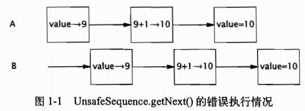

## 1.1 并发简史
操作系统的出现使得计算机每次能运行多个程序，并且不同的程序都在单独的进程中运行:操作系统为各个独立执行的进程分配各种资源，包括内存，文件句柄以及安全证书等。如果需要的话，在不同的进程之间可以通过一些粗粒度的通信机制来交换数据，包括:套接字
信号处理器、共享内存、信号量以及文件等。之所以在计算机中加入操作系统来实现多个程序的同时执行，主要是基于以下原因:资源利用率。在某些情况下，程序必须等待某个外部操作执行完成，例如输入操作或输出操作等，而在等待时程序无法执行其他任何工作。因此，如果在等待的同时可以运行另一个程序，
那么无疑将提高资源的利用率。公平性。不同的用户和程序对于计算机上的资源有着同等的使用权。一种高效的运行方式是通过粗粒度的时间分片(Time Slicing)使这些用户和序能共享计算机资源，而不是由一个程序从头运行到尾，然后再启动下一个程序。
便利性。通常来说，在计算多个任务时，应该编写多个程序，每个程序执行一个任务并在必要时相互通信，这比只编写一个程序来计算所有任务更容易实现。
在早期的分时系统中，每个进程相当于一台虚拟的冯·诺依曼计算机，它拥有存储指令和数据的内存空间，根据机器语言的语义以串行方式执行指令，并通过一组 I/0 指与外部设备通信。对每条被执行的指令，都有相应的“下一条指令”，程序中的控制流是按照指令集的规则来确定的。当前，几乎所有的主流编程语言都遵循这种串行编程模型，并且在这些语言的规范中也都清晰地定义了在某个动作完成之后需要执行的“下一个动作”。

线程允许在同一个进程中同时存在多个程序控制流。线程会共享进程范围内的资源，例如内存句柄和文件句柄，但每个线程都有各自的程序计数器 (Program Counter)、栈以及局部变量等。线程还提供了一种直观的分解模式来充分利用多处理器系统中的硬件并行性，而在同
个程序中的多个线程也可以被同时调度到多个 CPU 上运行。线程也被称为轻量级进程。在大多数现代操作系统中，都是以线程为基本的调度单位，而不是进程。如果没有明确的协同机制，那么线程将彼此独立执行。由于同一个进程中的所有线程都将共享进程的内存地址空间，因此这些线程都能访问相同的变量并在同一个堆上分配对象，这就需要实现一种比在进程间共享数据粒度更细的数据共享机制。如果没有明确的同步机制来协同对共享数据的访问，那么当一个线程正在使用某个变量时，另一个线程可能同时访问这个变量，这将造成不可预测的结果。

## 1.2 线程优势
如果使用得当，线程可以有效地降低程序的开发和维护等成本，同时提升复杂应用程序的性能。线程能够将大部分的异步工作流转换成串行工作流，因此能更好地模拟人类的工作方式和交互方式。此外，线程还可以降低代码的复杂度，使代码更容易编写、阅读和维护。在GUI (Graphic User Interface，图形用户界面)应用程序中，线程可以提高用户界面的响应灵敏度，而在服务器应用程序中，可以提升资源利用率以及系统吞吐率。线程还可以简化IVM的实现，垃圾收集器通常在一个或多个专门的线程中运行。在许多重要的 Java 应用程序中，都在一定程度上用到了线程。

### 发挥多处理器的强大能力
由于基本的调度单位是线程，因此如果在程序中只有一个线程，那么最多同时只能在一个处理器上运行。在双处理器系统上，单线程的程序只能使用一半的 CPU 资源，而在拥有 100 个处理器的系统上，将有 99% 的资源无法使用。另一方面，多线程程序可以同时在多个处理器上执行。如果设计正确，多线程程序可以通过提高处理器资源的利用率来提升系统吞吐率。使用多个线程还有助于在单处理器系统上获得更高的吞吐率。如果程序是单线程的，那么当程序等待某个同步 I/0 操作完成时，处理器将处于空闲状态。而在多线程程序中，如果一个线程在等待 I/0 操作完成，另一个线程可以继续运行，使程序能够在 /0 阳寒期间继续运行(这就好比在等待水烧开的同时看报纸，而不是等到水烧开之后再开始看报纸)。

### 建模的简单性
通常，当只需要执行一种类型的任务(例如修改 12 个错误时，在时间管理方面比执行多种类型的任务(例如，修复错误、面试系统管理员的接任者、完成团队的绩效考核，以及为下个星期的报告做幻灯片)要简单。当只有一种类型的任务需要完成时，只需埋头工作，直到完成所有的任务(或者你已经精疲力尽)，你不需要花任何精力来琢磨下一步该做什么。而另一方面，如果需要完成多种类型的任务，那么需要管理不同任务之间的优先级和执行时间，并
在任务之间进行切换，这将带来额外的开销。对于软件来说同样如此:如果在程序中只包含一种类型的任务，那么比包含多种不同类型任务的程序要更易于编写，错误更少，也更容易测试。如果为模型中每种类型的任务都分配一个专门的线程，那么可以形成一种串行执行的假象，并将程序的执行逻辑与调度机制的细节交替执行的操作，异步 I/0 以及资源等待等问题分离开来。通过使用线程，可以将复杂并且异步的工作流进一步分解为一组简单且同步的工作流，每个工作流在一个单独的线程中运行并在特定的同步位置进行交互。
我们可以通过一些现有的框架来实现上述目标，例如Servlet和RMI(Remote MethodInvocation，远程方法调用)。框架负责解决一些细节问题，例如请求管理、线程创建、负载平衡，并在正确的时刻将请求分发给正确的应用程序组件。编写 Servlet 的开发人员不需要了解有多少请求在同一时刻要被处理，也不需要了解套接字的输入流或输出流是否被阻塞。当调用Servlet 的 service 方法来响应 Web 请求时，可以以同步方式来处理这个请求，就好像它是一个单线程程序。这种方式可以简化组件的开发，并缩短掌握这种框架的学习时间。

异步事件的简化处理
服务器应用程序在接受来自多个远程客户端的套接字连接请求时，如果为每个连接都分配其各自的线程并且使用同步 I/0，那么就会降低这类程序的开发难度。如果某个应用程序对套接字执行读操作而此时还没有数据到来，那么这个读操作将一直阳塞，直到有数据到达。在单线程应用程序中，这不仅意味着在处理请求的过程中将停顿，而且还意味着在这个线程被阻塞期间，对所有请求的处理都将停顿。为了避免这个问题，单线程服

务器应用程序必须使用非阻塞 /0，这种 I/0 的复杂性要远远高于同步 /0，并且很容易出错然而，如果每个请求都拥有自己的处理线程，那么在处理某个请求时发生的阻塞将不会影响其
他请求的处理。早期的操作系统通常会将进程中可创建的线程数量限制在一个较低的闹值内，大约在数百个(甚至更少)左右。因此，操作系统提供了一些高效的方法来实现多路 I/0，例如 Unix 的select 和 poll 等系统调用，要调用这些方法Java 类库需要获得一组实现非阻塞I/0 的包 (iavanio)。然而，在现代操作系统中，线程数量已得到极大的提升，这使得在某些平台上，即使有更多的客户端，为每个客户端分配一个线程也是可行的9

应更灵敏的用户界面
传统的 GUI应用程序通常都是单线的，从而在代码的各个位置都需要调用 pol1 方法来获得输人事件(这种方式将给代码带来极大的混乱)，或者通过一个“主事循环(Main EventLoop)”来间接地执行应用程序的所有代码。如果在主事件循环中调用的代码需要很长时间才能执行完成，那么用户界面就会“冻结”，直到代码执行完成。这是因为只有当执行控制权返回到主事件循环后，才能处理后续的用户界面事件。
在现代的GUI框架中，例如AWT和Swing等工具，都采用一个事件分发线程 (EventDispatch ThreadEDT)来替代事件循环。当某个用户界面事件发生时(例如按下一个按)在事件线程中将调用应用程序的事件处理器。由于大多数 GUI 框架都是单线程子系统，因此到目前为止仍然存在主事件循环，但它现在处于 GUI工具的控制下并在其自己的线程中运行，而
不是在应用程序的控制下。如果在事件线程中执行的任务都是短暂的，那么界面的响应灵敏度就较高，因为事件线程能够很快地处理用户的动作。然而，如果事件线程中的任务需要很长的执行时间，例如对一个大型文档进行拼写检查，或者从网络上获取一个资源，那界面的响应灵度就会降低。如果用户在执行这类任务时触发了某个动作，那么必须等待很长时间才能获得响应，因为事件线程要先执行完该任务。更糟糕的是，不仅界面失去响应，而且即使在界面上包含了“取消”按钮也无法取消这个长时间执行的任务，因为事件线程只有在执行完该任务后才能响应“取消”按钮的点击事件。然而，如果将这个长时间运行的任务放在一个单独的线程中运行，那么事件线程就能及时地处理界面事件，从而使用户界面具有更高的灵敏度。

## 线程带来的风险
Java 对线程的支持其实是一把双刃剑。虽然 Java 提供了相应的语言和库，以及一种明确的跨平台内存模型(该内存模型实现了在 Java 中开发“编写一次，随处运行”的并发应用程序),这些工具简化了并发应用程序的开发，但同时也提高了对开发人员的技术要求，因为在更多的
程序中会使用线程。当线程还是一项鲜为人知的技术时，并发性是一个“高深的”主题，但现在，主流开发人员都必须了解线程方面的内容。
1.31安全性问题
线程安全性可能是非常复杂的，在没有充足同步的情况下，多个线程中的操作执行顺序是不可预测的，甚至会产生奇怪的结果。在程序清单 1-1的 UnsafeSequence 类中将产生一个整数值序列，该序列中的每个值都是唯一的。在这个类中简要地说明了多个线程之间的交替操作将如何导致不可预料的结果。在单线程环境中，这个类能正确地工作，但在多线程环境中则不能。
public class UnsafeSequenceprivate int value;
/** 返回一个唯一的数值。*/public int getNext() [return value++;

通过将 getNext修改为一个同步方法，可以修复 UnsafeSequence 中的错误，如果没有同步，那么无论是编译器、硬件还是运行时，都可以随意安排操作的执行时间和顺序，例如对寄存器或者处理器中的变量进行缓存，而这些被缓存的变量对于其他线程来说是暂时(甚至永久)不可见的。虽然这些技术有助于实现更优的性能，并且通常也是值得采用的方法，但它们也为开发人员带来了负担，因为开发人员必须找出这些数据在哪些位置被多个线程共享，只有这样才能使这些优化措施不破坏线程安全性

2活跃性问题
在开发并发代码时，一定要注意线程安全性是不可破坏的。安全性不仅对于多线程序很重要，对于单线程程序同样重要。此外，线程还会导致一些在单线程程序中不会出现的问题，例如活跃性问题。
安全性的含义是“永远不发生糟糕的事情”，而活跃性则关注于另一个目标，即“某件正确的事情最终会发生”。当某个操作无法继续执行下去时，就会发生活跃性问题。在串行程序中，活跃性问题的形式之一就是无意中造成的无限循环，从而使循环之后的代码无法得到执行。线程将带来其他一些活跃性问题。例如，如果线程 A 在等待线 B 释放其持有的资源，而线程B永远都不释放该资源，那么 A 就会永地等待下去。第 10 章将介绍各种形式的活跃性问题，以及如何避免这些问题，包括死锁 (10.1节)，(10.3.1节)，以及活锁 (10.3.3节)。与大多数并发性错误一样，导致活跃性问题的错误同样是难以分析的，因为它们依赖于不同线程的事件发生时序，因此在开发或者测试中并不总是能够重现。
1.3.3性能问题
与活跃性问题密切相关的是性能问题。活跃性意味着某件正确的事情最终会发生，但却不够好，因为我们通常希望正确的事情尽快发生。性能问题包括多个方面，例如服务时间过长，响应不灵敏，吞吐率过低，资源消耗过高，或者可伸缩性较低等。与安全性和活跃性一样，在多线程程序中不仅存在与单线程程序相同的性能问题，而且还存在由于使用线程而引入的其他
性能问题。在设计良好的并发应用程序中，线程能提升程序的性能，但无论如何，线程总会带来某种程度的运行时开销。在多线程程序中，当线程调度器临时挂起活跃线程并转而运行另一个线程时，就会频繁地出现上下文切换操作 (Context Switch)，这种操作将带来极大的开销:保存和恢复执行上下文，丢失局部性，并且 CPU 时间将更多地花在线程调度而不是线程运行上。当线程共享数据时，必须使用同步机制，而这些机制往往会抑制某些编译器优化，使内存缓存区中的数据无效，以及增加共享内存总线的同步流量。所有这些因素都将带来额外的性能开销，第11 章将详细介绍如何分析和减少这些开销。

