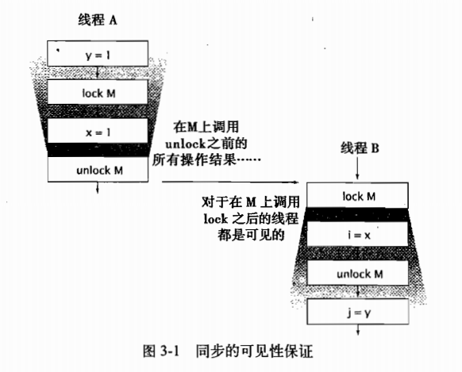

第2章的开头曾指出，要编写正确的并发程序，关键问题在于:在访问共享的可变状态时需要进行正确的管理。第 2 章介绍了如何通过同步来避免多个线程在同一时刻访问相同的数据，而本章将介绍如何共享和发布对象，从而使它们能够安全地由多个线程同时访问。这两章合在一起，就形成了构建线程安全类以及通过 javautilconcurrent 类库来构建并发应用程序的重要基础。我们已经知道了同步代码块和同步方法可以确保以原子的方式执行操作，但一种常见的误解是，认为关键字synchronized 只能用于实现原子性或者确定“临界区(Critical Section)”。同步还有另一个重要的方面:内存可见性(Memory Visibility)。我们不仅希望防止某个线程正在使用对象状态而另一个线程在同时修改该状态，而且希望确保当一个线程修改了对象状态后，其他线程能够看到发生的状态变化。如果没有同步，那么这种情况就无法实现。你可以通过显式的同步或者类库中内置的同步来保证对象被安全地发布。

3.1可见性
可见性是一种复杂的属性，因为可见性中的错误总是会违背我们的直觉。在单线程环境中，如果向某个变量先写入值，然后在没有其他写入操作的情况下读取这个变量，那么总能得到相同的值。这看起来很自然。然而，当读操作和写操作在不同的线程中执行时，情况却并非如此，这听起来或许有些难以接受。通常，我们无法确保执行读操作的线程能适时地看到其他线程写入的值，有时甚至是根本不可能的事情。为了确保多个线程之间对内存写入操作的可见
性，必须使用同步机制。在程序清单 3-1 中的 NoVisibility 说明了当多个线程在没有同步的情况下共享数据时出现的错误。在代码中，主线程和读线程都将访问共享变量 ready 和 number。主线程启动读线程然后将number 设为42，并将ready 设为 true。读线程一直循环直到发现 ready 的值变为 true,然后输出 number的值。虽然 NoVisibility 看起来会输出42，但事实上很可能输出0，或者根本无法终止。这是因为在代码中没有使用足够的同步机制，因此无法保证主线程写入的 ready 值和 number 值对于读线程来说是可见的。

程序清单 3-1 在没有同步的情况下共享变量(不要这么做)
public class NoVisibility (
private static boolean ready;
private static int number;
private static class ReaderThread extends Thread [public void run() !while (!ready)
Thread.yield();
System.out.println(number);
public static void main(String[] args) [new ReaderThread() .start();number = 42;
ready = true;
NoVisibility 可能会持续循环下去，因为读线可能永远都看不到 ready 的值。一种更奇怪的现象是，NoVisibility 可能会输出0，因为读线程可能看到了写人 ready 的值，但却没有看到之后写入 number 的值，这种现象被称为“重排序(Reordering)”。只要在某个线程中无法检测到重排序情况(即使在其他线程中可以很明显地看到该线程中的重排序)，那么就无法确保线程中的操作将按照程序中指定的顺序来执行
3.1.1效数据
NoVisibility 展示了在缺乏同步的程序中可能产生错误结果的一种情况:失效数据。当读线程查看 ready 变量时，可能会得到一个已经失效的值。除非在每次访问变量时都使用同步，否则很可能获得该变量的一个失效值。更糟糕的是，失效值可能不会同时出现:一个线程可能获得某个变量的最新值，而获得另一个变量的失效值。

失效值可能会导致一些严重的安全问题或者活跃性问题。在NoVisibility 中，失效数据可能导致输出错误的值，或者使程序无法结束。如果对象的引用(例如链表中的指针)失效，那么情况会更复杂。失效数据还可能导致一些令人困惑的故障，例如意料之外的异常、被破坏的数据结构、不精确的计算以及无限循环等。程序清单 3-2 中的 Mutablelnteger 不是线程安全的，因为 get 和 set 都是在没有同步的情况下访问 value 的。与其他问题相比，失效值问题更容易出现如果某个线程调用了 set，那么另个正在调用 get 的线程可能会看到更新后的 value 值，也可能看不到。
程序清单3-2 非线程安全的可变整数类
@NotThreadsafepublic class MutableInteger fprivate int value;
public intget()return value;public void set(int value) [ this.value = value;
在程序清单3-3 的SynchronizedInteger 中，通过对 get和 set 等方法进行同步，可以使MutableInteger 成为一个线程安全的类。仅对 set 方法进行同步是不够的，调用get 的线仍然会看见失效值。

3.1.2 非原子的64 位操作
当线程在没有同步的情况下读取变量时，可能会得到一个失效值，但至少这个值是由之前某个线程设置的值，而不是一个随机值。这种安全性保证也被称为最低安全性( out-of-thin-airsafety)
最低安全性适用于绝大多数变量，但是存在一个例外: 非 latile 型的64 位数值变量(double 和long，请参见3.1.4 节)。Java 内存模型要求，变量的读取操作和写入操作都必须是原子操作，但对于非 volatile 类型的 long 和 double 变量JVM允许将64位的读操作或写操作
分解为两个32 位的操作。当读取一个非 volatile 类型的 lng 变量时，如果对该变量的读操作和写操作在不同的线程中执行，那么很可能会读取到某个值的高 32 位和另一个值的低 32 位因此，即使不考虑失效数据问题，在多线程程序中使用共享且可变的 long和 double 等类型的变量也是不安全的，除非用关键字volatile 来声明它们，或者用锁保护起来。
3.1.3 加锁与可见性
内置锁可以用于确保某个线程以一种可预测的方式来查看另一个线程的执行结果，如图 3-1 所示。当线程A执行某个同步代码块时，线 B 随后进由同一个锁保护的同步代码块，在这种情况下可以保，在锁被释放之前，A 看到的变量值在 B 获得锁后同样可以由 B看到。换句话说，当线程 B 执行由锁保护的同步代码块时，可以看到线程 A 之前在同一个同步代码块中的所有操作结果。如果没有同步，那么就无法实现上述保证。

现在，我们可以进一步理解为什么在访问某个共享且可变的变量时要求所有线程在同一个锁上同步，就是为了确保某个线程写入该变量的值对于其他线程来说都是可见的。否则，如果一个线程在未持有正确锁的情况下读取某个变量，那么读到的可能是一个失效值。

3.1.4 Volatile 变量
Java 语言提供了一种稍弱的同步机制，即 volatile 变量，用来确保将变量的更新操作通知

到其他线程。当把变量声明为 vlatile 类型后，编译器与运行时都会注意到这个变量是共享的因此不会将该变量上的操作与其他内存操作一起重排序。vlatile 变量不会被缓存在寄存器或者对其他处理器不可见的地方，因此在读取 volatile 类型的变量时总会返回最新写入的值。理解 volatile变量的一种有效方法是，将它们的行为想象成程序清单3-3 中 SynchronizedInteger的类似行为，并将 volaLile 变量的读操作和写操作分别替换为 get 方法和 set 方法。然而，在访问 volatile 变量时不会执行加锁操作，因此也就不会使执行线程阻塞，因此 volatile 变量是一
种比 sychronized 关键字更轻量级的同步机制。volatile变量对可见性的影响比 volatile 变量本身更为重要。当线程A首先写入一个volatile 变量并且线程 B 随后读取该变量时，在写入 volatile 变量之前对 A 可见的所有变量的值，在B读取了 volatile变景后，对B也是可见的。因此，从内存可见性的角度来看，写入volatile 变量相当于退出同步代码块，而读取 volatile 变量就相当于进入同步代码块。然而，我们并不建议过度依赖 volatile 变量提供的可见性。如果在代码中依赖 olatile 变量来控制状态的可见性，通常比使用锁的代码更脆弱，也更难以理解。
仅当volatile变量能简化代码的实现以及对同步策略的验证时，才应该使用它们。如果在验证正确性时需要对可见性进行复杂的判断，那么就不要使用 volatile变量。volatile变量的正确使用方式包括:确保它们自身状态的可见性，确保它们所引用对象的状态的可见性，以及标识一些重要的程序生命周期事件的发生《例如，初始化或关闭)。

 volatile变量的一种典型用法:检查某个状态标记以判断是否退出循环。
asleep 必须为 yolatile 变量。否则，当 asleep 被另一个线程修改时，执行判断的线程却发现不了
调试小提示:对于服务器应用程序，无论在开发阶段还是在测试阶段，当启动JVM 时一定都要指定 -serve命令行选项。server 模式的JVM 比 client 式的JVM 进行更多的优化，例如环中未被修改的变量提升到循环外部，因此在开发环境 (clint 模的JVM)中能正确运行的代码可能会在部环境(server 模式的JVM)中运行失败。例如如果在序清单3-4中“忘记”把 asleep 变量声明为 vlatile型那scrver 模式的JVM 会将 aslep 的判断条件升到循体外部 (这导致一个无限 client 模式的JVM 不会这么做。在解决开发环境中出现无限循环问题时，解决这个问题的开销远小于解决在应用环境出现无限循环的开销。
当且仅当满足以下所有条件时，才应该使用 volatile 变量:对变量的写人操作不依赖变量的当前值，或者你能确保只有单个线程更新变量的值该变量不会与其他状态变量一起纳人不变性条件中。在访问变量时不需要加锁。

3.2发布与逸出
“发布(Publish)”一个对的意思是指，使对象能够在当前作用域之外的代码中使用。例如，将一个指向该对象的引用保存到其他代码可以访问的地方，或者在某一个非私有的方法中返回该引用，或者将引用传递到其他类的方法中。在许多情况中，我们要确保对象及其内部状态不被发布。而在某些情况下，我们又需要发布某个对象，但如果在发布时要确保线程安全性，则可能需要同步。发布内部状态可能会破坏封装性，并使得程序难以维持不变性条件。例如，如果在对象构造完成之前就发布该对象，就会破坏线程安全性。当某个不应该发布的对象被发布时，这种情况就被称为逸出( Escape)。3.5 节介绍了如何安全发布对象的一些方法。现
在，我们首先来看看一个对象是如何逸出的。发布对象的最简单方法是将对象的引用保存到一个公有的静态变量中，以便任何类和线程都能看见该对象，如程序清单 3-5 所示。在 initialize 方法中实例化一个新的 HashSet 对象，并将对象的引用保存到 knownSecrets 中以发布该对象。
public static Set<Secret> knownSecrets;
public void initialize() knownSecrets = new HashSet<Secret>();
当发布某个对象时，可能会间接地发布其他对象。如果将一个 Secret 对象添加到集合knownSecrets中，那么同样会发布这个对象，因为任何代码都可以遍历这个集合，并获得对这个新 Secret 对象的引用。同样，如果从非私有方法中返回一个引用，那么同样会发布返回的对象。程序清单 3-6 中的 UnsafeStates 发布了本应为私有的状态数组。

当发布某个对象时，可能会间接地发布其他对象。如果将一个 Secret 对象添加到集合knownSecrets中，那么同样会发布这个对象，因为任何代码都可以遍历这个集合，并获得对这个新 Secret 对象的引用。同样，如果从非私有方法中返回一个引用，那么同样会发布返回的对象。程序清单 3-6 中的 UnsafeStates 发布了本应为私有的状态数组。

程序清单 3-6 使内部的可变状态逸出(不要这么做)
class Unsafestates i
private Stringl states = new String[] 
"AK，AL
public string[l getstates() [ return states;
如果按照上述方式来发布 states，就会出现问题，因为任何调用者都能修改这个数组的内容。在这个示例中，数组 states 已经出了它所在的作用域，因为这个本应是私有的变量已经被发布了

无论其他的线程会对已发布的引用执行何种操作，其实都不重要，因为误用该引用的风险始终存在9。当某个对象逸出后，你必须假设有某个类或线程可能会误用该对象。这正是需要使用封装的最主要原因，封装能够使得对程序的正确性进行分析变得可能，并使得无意中破坏
设计约束条件变得更难。
最后一种发布对象或其内部状态的机制就是发布一个内部的类实例，如程序清单 3-7 的ThisEscape 所示。当ThisEscape 发布 EventListener 时，也隐含地发布了 ThisEscape 实例本身因为在这个内部类的实例中包含了对 ThisEscape 实例的隐含引用
程序清单 3-7 隐式地使 this 引用逸出(不要这么做)
public class ThisEscape public ThisEscape(EventSource source)source.registerListener(
new EventListener()public void onEvent(Event e)doSomething(e);

安全的对象抢匙臂昂段奔百苍耽椒谤诫过程
在 ThisEscape 中给出了逸出的一个特殊示例，即 this 引用在构造函数中逸出。当内部的EventListener 实例发布时，在外部封装的 ThisEscape 实例也逸出了。当且仅当对象的构造函数返回时，对象才处于可预测的和一致的状态。因此，当从对象的构造函数中发布对象时，只是发布了一个尚未构造完成的对象。即使发布对象的语句位于构造函数的最后一行也是如此。如果 this 引用在构造过程中逸出，那么这种对象就被认为是不正确构造
在构造过程中
在构造过程中使 this 引用逸出的一个常见错误是，在构造函数中启动一个线程。当对象在其构造函数中创建一个线程时，无论是显式创建(通过将它传给构造函数)还是隐式创建(由于Thread 或 Runnable 是该对象的一个内部类this 引用都会被新创建的线程共享。在对象尚未完全构造之前，新的线程就可以看见它。在构造函数中创建线程并没有错误，但最好不要立即启动它，而是通过一个 start 或 initialize 方法来启动(请参见第7章了解更多关于服务生命周期的内容)。在构造函数中调用一个可改写的实例方法时(既不是私有方法，也不是终结方法)，同样会导致 this 引用在构造过程中逸出。

如果想在构造函数中注册一个事件监听器或启动线程，那么可以使用一个私有的构造函数和一个公共的工厂方法(Factory Method)，从而避免不正确的构造过程，如程序清单3-8 中SafeListener 所示。
程序清单 3-8 使用工厂方法来防止this 引用在构造过程中逸出
public class SafeListener (private final EventListener listener;
private SafeListener() (listener = new EventListener() public void onEvent (Event e) [doSomething(e);
public static SafeListener newInstance(EventSource source)(SafeListener safe = new SafeListener();source.registerListener(safe.listener);return safe;

线程封闭33
当访问共享的可变数据时，通常需要使用同步。一种避免使用同步的方式就是不共享数据。如果仅在单线程内访问数据，就不需要同步。这种技术被称为线程封闭 (ThreadConfinement)，它是实现线程安全性的最简单方式之一。当某个对象封闭在一个线程中时，这种用法将自动实现线程安全性，即使被封闭的对象本身不是线安全的[CPJ2.3.2]
在Swing 中大量使用了线程封闭技术。Swing 的可视化组件和数据模型对象都不是线程安全的，Swing 通过将它们封闭到 Swing 的事件分发线程中来实现线程安全性。要想正确地使用Swing，那么在除了事件线程之外的其他线程中就不能访问这些对象(为了进一步简化对 Swing的使用,Swing还提供了invokeLater 机制，用于将一个 Runnable 实例度到事件线程中执行)Swing应用程序的许多并发错误都是由于错误地在另一个线程中使用了这些被封闭的对象。线程封闭技术的另一种常见应用是JDBC(Java Database Connectivity)的 Connection 对象JDBC规范并不要求 Connection 对象必须是线程安全的9。在典型的服务器应用程序中，线程从连接池中获得一个 Connection 对象，并且用该对象来处理请求，使用完后再将对象返还给连接池。由于大多数请求(例如 Servlet 请求或 EJB 用等) 都是由单个线程采用同步的方式来处理，并且在 Connection 对象返回之前，连接池不会再将它分配给其他线程，因此，这种连接管理模式在处理请求时隐含地将 Connection对象封闭在线程中。在Java 语言中并没有强制规定某个变量必须由锁来保护，同样在 Java 语言中无法强制将对象封闭在某个线程中。线程封闭是在程序设计中的一个考虑因素，必须在程序中实现。Java 语言及其核心库提供了一些机制来帮助维持线程封闭性，例如局部变量和 ThreadLocal类但即便如此，程序员仍然需要负责确保封闭在线程中的对象不会从线程中逸出。
3.3.1Ad-hoc线程封闭
Ad-hoc 线程封闭是指，维护线程封闭性的职责完全由程序实现来承担。Ad-hoc 线程封闭是非常脆弱的，因为没有任何一种语言特性，例如可见性修饰符或局部变量，能将对象封闭到目标线程上。事实上，对线程封闭对象(例如，GUI应用程序中的可视化组件或数据模型等)
的引用通常保存在公有变量中。当决定使用线程封闭技术时，通常是因为要将某个特定的子系统实现为一个单线程子系统。在某些情况下，单线程子系统提供的简便性要胜过 Ad-hoc 线程封闭技术的脆弱性。在 volatile变量上存在一种特殊的线程封闭。只要你能确保只有单个线程对共享的 volatile变量执行写入操作，那么就可以安全地在这些共享的 volatile 变量上执行“读取一修改-写人”的操作。在这种情况下，相当于将修改操作封闭在单个线程中以防止发生竞态条件，并且volatile变量的可见性保摸驳白啊矮阿伴邦肮傲癌岸编鞍稗鞍餐氨哀确保了其他线程能看到最新的值。

3.3.2栈封闭
栈封闭是线程封闭的一种特例，在栈封闭中，只能通过局部变量才能访问对象。正如封装能使得代码更容易维持不变性条件那样，同步变量也能使对象更易于封闭在线程中。局部变量的固有属性之一就是封闭在执行线程中。它们位于执行线程的栈中，其他线程无法访问这个栈。栈封闭(也被称为线程内部使用或者线程局部使用，不要与核心类库中的 ThreadLocal混
淆)比 Ad-hoc 线程封闭更易于维护，也更加健壮。对于基本类型的局部变量，例如程序清单 3-9 中ladTheArk 方法的numPairs，无论如何都不会破坏栈封闭性。由于任何方法都无法获得对基本类型的引用，因此 Java 语言的这种语义就确保了基本类型的局部变量始终封闭在线程内。
程序清单3-9基本类型的局部变量与引用变量的线程封闭性
public int loadTheArk(Collection<Animal> candidates)[Sortedset<Animal> animals;int numPairs = 0;Animal candidate = null;
// animals 被封闭在方法中，不要使它们逸出!animals =new TreeSet<Animal>(new SpeciesGenderComparator());animals.addAll(candidates);for (Animal a : animals) (if (candidate == null !candidate,isPotentialMate(a))candidate = a;else (ark.load(new AnimalPair(candidate, a));++numPairs;
candidate = null;
return numPairs;
在维持对象引用的栈封闭性时，程序员需要多做一些工作以确保被引用的对象不会逸出在loadTheArk 中实例化一个 TreeSet 对象，并将指向该对象的一个引用保存到animals 中。此时，只有一个引用指向集合 animals，这个引用被封闭在局部变量中，因此也被封闭在执行线程中。然而，如果发布了对集合 animals(或者该对象中的任内部数据)的引用，那么封性将
被破坏，并导致对象animals 的逸出如果在线程内部(Within-Thread)上下文中使用非线程安全的对象，那么该对象仍然是线程安全的。然而，要小心的是，只有编写代码的开发人员才知道哪些对象需要被封闭到执行线程中，以及被封闭的对象是否是线程安全的。如果没有明确地说明这些需求，那么后续的维护人员很容易错误地使对象逸出。

3.3.3ThreadLocal 类
维持线程封闭性的一种更规范方法是使用 ThreadLocal，这个类能使线程中的某个值与保存值的对象关联起来。ThreadLocal 提供了 get 与 set 等访问接口或方法，这些方法为每个使用该变量的线程都存有一份独立的副本，因此 get 总是返由当前执行线在用 set 时设置的最新值。ThreadLocal 对象通常用于防止对可变的单实例变量 (Singleton)或全局变量进行共享例如，在单线程应用程序中可能会维持一个全局的数据库连接，并在程序启动时初始化这个连接对象，从而避免在调用每个方法时都要传递一个 Connection 对象。由于JDBC 的连接对象不一定是线程安全的，因此，当多线程应用程序在没有协同的情况下使用全局变量时，就不是线程安全的。通过将JDBC的连接保存到 ThreadLocal对象中，每个线程都会拥有属于自己的连接，如程序清单3-10中的 ConnectionHolder 所示
程序清单3-10 使用ThreadLocal 来维持线程封闭性
private static ThreadLocal<Connection> connectionHolder= new ThreadLocal<Connection>() public Connection initialValue() (return DriverManager.getConnection(DB URL);
public static Connection getConnection() [return connectionHolder.get ();
当某个频繁执行的操作需要一个临时对象，例如一个缓冲区，而同时又希望避免在每次执行时都重新分配该临时对象，就可以使用这项技术。例如，在 Java 5.0 之前，Integer.toString(方法使用 ThreadLocal对象来保存一个 12字节大小的缓冲区，用于对结果进行格式化，而不是使用共享的静态缓冲区(这需要使用锁机制)或者在每次调用时都分配一个新的缓冲区当某个线程初次调用 ThreadLocal.get 方法时，就会调用 initialValue 来获取初始值。从概念上看，你可以将 ThreadLocal<T>视为包含了Map< Thread,T> 对象，其中保存了特定于该线程的值，但 ThreadLocal的实现并非如此。这些特定于线程的值保存在 Thread 对象中，当线程终止后，这些值会作为垃圾回收。
假设你需要将一个单线程应用程序移植到多线程环境中，通过将共享的全局变量转换为ThreadLocal 对象(如果全局变量的语义允许)，可以维持线程安全性。然而，如果将应用程序范围内的缓存转换为线程局部的缓存，就不会有太大作用。在实现应用程序框架时大量使用了 ThreadLocal。例如，在 EJB 调用期间，J2EE 容器需要将个事上下文(Transaction Context)与某个执行中的线程关联起来。通过将事务上下文保存在静态的 ThreadLocal对象中，可以很容易地实现这个功能:当框架代码需要判断当前运行的是哪个事务时，只需从这个 ThreadLocal对象中读取事务上下文。这种机制很方便，因为它避免了在调用每个方法时都要传递执行上下文信息，然而这也将使用该机制的代码与框架耦合在一起。开发人员经常滥用 ThreadLocal，例如将所有全局变量都作为 ThreadLocal 对象，或者作为一种“隐藏”方法参数的手段。ThreadLocal 变量类似于全局变量，它能降低代码的可重用性并在类之间引入隐含的耦合性，因此在使用时要格外小心。
3.4 不变性
满足同步需求的另一种方法是使用不可变对象 (Immutable Obiect)[EJtem 13]。到目前为止，我们介绍了许多与原子性和可见性相关的问题，例如得到失效数据，丢失更新操作或者观察到某个对象处于不一致的状态等等，都与多线程试图同时访问同一个可变的状态相关。如果对象的状态不会改变，那么这些问题与复杂性也就自然消失了。如果某个对象在被创建后其状态就不能被修改，那么这个对象就称为不可变对象。线程安全性是不可变对象的固有属性之一，它们的不变性条件是由构造函数创建的，只要它们的状态不改变，那么这些不变性条件就能得以维持。
不可变对象一定是线程安全的。
不可变对象很简单。它们只有一种状态，并且该状态由构造函数来控制。在程序设计中个最困难的地方就是判断复杂对象的可能状态。然而，判断不可变对象的状态却很简单。同样，不可变对象也更加安全。如果将一个可变对象传递给不可信的代码，或者将该对象发布到不可信代码可以访问它的地方，那么就很危险一一不可信代码会改变它们的状态，更精的是，在代码中将保留一个对该对象的引用并稍后在其他线程中修改对象的状态。另一方面不可变对象不会像这样被恶意代码或者有问题的代码破坏，因此可以安全地共享和发布这些对象，而无须创建保护性的副本[EJItem 24]。
虽然在Java 语言规范和Java 内存模型中都没有给出不可变性的正式定义，但不可变性并不等于将对象中所有的域都声明为 final 类型，即使对象中所有的域都是 final 类型的，这个对象也仍然是可变的，因为在 final 类型的域中可以保存对可变对象的用
当满足以下条件时，对象才是不可变的
·对象创建以后其状态就不能修改。
对象的所有域都是final类型。
。对象是正确创建的《在对象的创建期间，this引用没有远出)
在不可变对象的内部仍可以使用可变对象来管理它们的状态，如程序清单 3-11 中的ThreeStooges 所示。尽管保存姓名的 Set 对象是可变的，但从 ThreeStooges 的设计中可以看到，在Set 对象构造完成后无法对其进行修改。stooges 是一个fial类型的引用变量，因此所有的对象状态都通过一个 final 域来访问。最后一个要求是“正确地构造对象”，这个要求很容易满足因为构造函数能使该引用由除了构造函数及其调用者之外的代码来访问。
程序清单3-11 在可变对象基础上构建的不可变类
@Immutable
public final class ThreeStooges (private final Set<String> stooges = new HashSet<String>();
public ThreeStooges() fstooges.add("Moe");stooges.add("Larry");stooges.add(“Curly") ;
public boolean isStooge(string name) [return stooges .contains(name);
由于程序的状态总在不断地变化，你可能会认为需要使用不可变对象的地方不多，但实际情况并非如此。在“不可变的对象”与“不可变的对象引用”之间存在着差异。保存在不可变对象中的程序状态仍然可以更新，即通过将一个保存新状态的实例来“替换”原有的不可变对象。下一节将给出使用这项技术的示例。e
3.4.1Final 域
关键字 final可以视为 C++ 中 const 机制的一种受限版本，用于构造不可变性对象。final类型的域是不能修改的(但如果 final 域所引用的对象是可变的，那么这些被引用的对象是可以修改的)。然而，在 Java 内存模型中，final 域还有着特殊的语义。final 域能确保初始化过程的安全性，从而可以不受限制地访问不可变对象，并在共享这些对象时无须同步。即使对象是可变的，通过将对象的某些域声明为 fimal 类型，仍然可以简化对状态的判断因此限制对象的可变性也就相当于限制了该对象可能的状态集合。仅包含一个或两个可变状态的“基本不可变”对象仍然比包含多个可变状态的对象简单。通过将域声明为 final类型，也相当于告诉维护人员这些域是不会变化的。
示例:使用 Volatile 类型来发布不可变对象3.4.2
在前面的 UnsafeCachingFactorizer 类中，我们尝试用两个 AtomicReferences 变量来保存最新的数值及其因数分解结果，但这种方式并非是线程安全的，因为我们无法以原子方式来同时读取或更新这两个相关的值。同样，用 volatile 类型的变量来保存这些值也不是线程安全的。然而，在某些情况下，不可变对象能提供一种弱形式的原子性。
因式分解 Servlet 将执行两个原子操作:更新缓存的结果，以及通过判断缓存中的数值是否等于请求的数值来决定是否直接读取缓存中的因数分解结果。每当需要对一组相关数据以原子方式执行某个操作时，就可以考虑创建一个不可变的类来包含这些数据，例如程序清单 3-12 中的 OneValueCache
程序清单 3-12对数值及其因数分解结果进行缓存的不可变容器类
@Immutableclass OneValueCache 
private final BigInteger lastNumber;private final BigInteger[] lastFactors;
public OneValueCache(BigInteger i,BigInteger[ factors) [
lastNumber = i;lastFactors = Arrays.copyof(factors, factorslength) ;
public BigInteger[] getFactors(BigInteger i) (if (lastNumber == null !astNumber .equals(i))return nu11:
else
return Arrays.copyOf(lastFactors， lastFactors.length) ;
对于在访问和更新多个相关变量时出现的竞争条件问题，可以通过将这些变量全部保存在一个不可变对象中来消除。如果是一个可变的对象，那么就必须使用锁来确保原子性。如果是一个不可变对象，那么当线程获得了对该对象的引用后，就不必担心另一个线程会修改对象的状态。如果要更新这些变量，那么可以创建一个新的容器对象，但其他使用原有对象的线程仍然会看到对象处于一致的状态。

程序清单3-13 中的 VolatileCachedFactorizer 使用了 OneValueCache 来保存缓存的数值及其因数。当--个线程将 volatile 类型的 cache 设置为引用一个新的OneValueCache 时，其他线程就会立即看到新缓存的数据。
程序清单 3-13 使用指向不可变容器对象的 volatile 类型引用以缓存最新的结果
@Threadsafepublic class VolatileCachedFactorizer implements Servlet{private volatile OneValueCache cache =
new OneValueCache (null， null);
public void service(ServletRequest req,ServletResponse resp)BigInteger i = extractFromRequest(req);BiqInteger门] factors = cache.getFactors(i);if (factors == null) (
factors = factor(i);
cache = new OneValueCache(i, factors);
encodeIntoResponse(resp， factors);
与 cache 相关的操作不会相互于扰，因为 OneValueCache 是不可变的，并且在每条相应的代码路径中只会访问它一次。通过使用包含多个状态变量的容器对象来维持不变性条件，并使用一个 volatile类型的引用来确保可见性，使得 Volatile Cached Factorizer 在没有显式地使用锁的情况下仍然是线程安全的。
3.5安全发布
到目前为止，我们重点讨论的是如何确保对象不被发布，例如让对象封闭在线程或另一个对象的内部。当然，在某些情况下我们希望在多个线程间共享对象，此时必须确保安全地进行共享。然而，如果只是像程序清单 3-14 那样将对象引用保存到公有域中，那么还不足以安全地发布这个对象。
程序清单 3-14 在没有足够同步的情况下发布对象(不要这么做)
// 不安全的发布public Holder holder;
public void initialize() (
holder = new Holder(42):
你可能会奇怪，这个看似没有问题的示例何以会运行失败。由于存在可见性问题，其他线程看到的 Holder 对象将处于不一致的状态，即便在该对象的构造函数中已经正确地构建了不变性条件。这种不正确的发布导致其他线程看到尚未创建完成的对象。
3.51不确的发确的对象被破
你不能指望一个尚未被完全创建的对象拥有完整性。某个观察该对象的线程将看到对象处于不一致的状态，然后看到对象的状态突然发生变化，即使线程在对象发布后还没有修改过它。事实上，如果程序清单 3-15 中的 Holder 使用程序清单3-14中的不安全发布方式，那么一个线程在调用assertSanity 时将抛出AssertionError。
程序清单3-15由于未被正确发布，因此这个类可能出现故障
public class Holder [private int n;
public Holder(int n) ( this.n = n;
public void assertSanity()(if (n != n)throw new AssertionError("This statement is false,");
由于没有使用同步来确保 Holder 对象对其他线程可见，因此将 Holder 称为“未被正确发布”。在未被正确发布的对象中存在两个问题。首先，除了发布对象的线程外，其他线程可以看到的 Holder 域是一个失效值，因此将看到一个空引用或者之前的旧值。然而，更糟糕的情况是，线程看到 Holder 引用的值是最新的，但 Holder 状态的值却是失效的。情况变得更加不预测的是，某个线程在第一次读取域时得到失效值，而再次读取这个域时会得到一个更新值，这也是assertSainty 抛出 AssertionError 的原因。
如果没有足够的同步，那么当在多个线程间共享数据时将发生一些非常奇怪的事情
不可变对象与初始化安全性3.5,2
由于不可变对象是一种非常重要的对象，因此 Java 内存模型为不可变对象的共享提供了一种特殊的初始化安全性保证。我们已经知道，即使某个对象的引用对其他线程是可见的，也并不意味着对象状态对于使用该对象的线程来说一定是可见的。为了确保对象状态能呈现出一致的视图，就必须使用同步。
另一方面，即使在发布不可变对象的引用时没有使用同步，也仍然可以安全地访问该对象。为了维持这种初始化安全性的保证，必须满足不可变性的所有需求 :状态不可修改，所有域都是 final类型，以及正确的构造过程。(如果程序清单 3-15 中的 Holder 对象是不可变的那么即使 Holder 没有被正确地发布，在assertSanity 中也不会抛出AssertionError。)
问题并不在于 Holder 类本身，而是在于 Hlder 类未被正确地发布。然而，如果将 n 声明为 fnal 类型，那么DHoldcr 将不可变，从而避免出现不正确发布的问题。请参见3.5.2 节。0尽管在构造函数中设置的域值似乎是第一次向这些域中写入的值，因此不会有“更旧的”值被视为失效值但 Object 的构造函数会在子类构造函数运行之前先将默认值写入所有的域。因此，某个域的默认值可能被视为失效值。
任何线程都可以在不需要额外同步的情况下安全地访问不可变对象，即使在发布这些对象时没有使用同步。
这种保证还将延伸到被正确创建对象中所有 final 类型的域。在没有额外同步的情况下，也可以安全地访问 final类型的域。然而，如果 final 类型的域所指向的是可变对象，那么在访问这些域所指向的对象的状态时仍然需要同步。
3.5.3安全发布的常用模式
可变对象必须通过安全的方式来发布，这通常意味着在发布和使用该对象的线程时都必须使用同步。现在，我们将重点介绍如何确保使用对象的线程能够看到该对象处于已发布的状态，并稍后介绍如何在对象发布后对其可见性进行修改。
要安全地发布二个对象，对象的引用以及对象的状态必须同时对其他线程可见。一个正确构造的对象可以通过以下方式来安全地发布:
·在静态初始化函数中初始化一个对象引用。
将对象的引用保存到 volatile类型的域或者AtomicReferance对象中。
·将对象的引用保存到某个正确构造对象的 final 类型域中。
将对象的引用保存到一个由锁保护的域中。
在线程安全容器内部的同步意味着，在将对象放入到某个容器，例如 Vector 或 synchronizedList时，将满足上述最后一条需求。如果线程 A 将对象放入一个线程安全的容器，随后线程 B读取这个对象，那么可以确保 B 看到A设置的X状态，即便在这段读/写的应用程序代码中没有包含显式的同步。尽管 Javadoc 任这个题上没有给出很清晰的说明，但线程安全库中的容器类提供了以下的安全发布保证:
通过将一个键或者值放入 Hashtable、synchronizedMap 或者 ConcurrentMap 中，可以安全地将它发布给任何从这些容器中访问它的线程(无论是直接访问还是通过迭代器访问)。通过将某个元素放入 Vector、CopyOnWriteArrayList、CopyOnWriteArraySet、synchronizedList或synchronizedSet 中，可以将该元素安全地发布到任何从这些容器中访问该元素的线程。通过将某个元素放入 BlockingQueue 或者 ConcurrentLinkedQueue 中，可以将该元素安全
地发布到任何从这些队列中访问该元素的线程。
类库中的其他数据传递机制(例如 Future 和 Exchanger)同样能实现安全发布，在介绍这些机制时将讨论它们的安全发布功能。
通常，要发布一个静态构造的对象，最简单和最安全的方式是使用静态的初始化器public static Holder holder = new Holder(42);
静态初始化器由JVM 在类的初始化阶段执行。由于在JVM 内部存在着同步机制，因此通过这种方式初始化的任何对象都可以被安全地发布[JLS 12.4.2

3.5.4事实不可变对象
如果对象在发布后不会被修改，那么对于其他在没有额外同步的情况下安全地访问这些对象的线程来说，安全发布是足够的。所有的安全发布机制都能确保，当对象的引用对所有访问该对象的线程可见时，对象发布时的状态对于所有线程也将是可见的，并且如果对象状态不会再改变，那么就足以确保任何访问都是安全的。
如果对象从技术上来看是可变的，但其状态在发布后不会再改变，那么把这种对象称为“事实不可变对象 (Effectively Immutable Object)”。这些对象不需要满足 3.4节中提出的不可变性的严格定义。在这些对象发布后，程序只需将它们视为不可变对象即可。通过使用事实不可变对象，不仅可以简化开发过程，而且还能由于减少了同步而提高性能。
在没有额外的同步的情况下，任何线程都可以安全地使用被安全发布的事实不可变对象。
例如，Date 本身是可变的，但如果将它作为不可变对象来使用，那么在多个线程之间共享 Date 对象时，就可以省去对锁的使用。假设需要维护一个 Map 对象，其中保存了每位用户的最近登录时间:
public Map<String， Date> iastLogin =Collections.synchronizedMap(new HashMap<String， Date>());
如果 Date 对象的值在被放人 Map 后就不会改变，那么synchronizedMap 中的同步机制就足以使 Date 值被安全地发布，并且在访问这些 Date 值时不需要额外的同步
3.5.5可变对象
如果对象在构造后可以修改，那么安全发布只能确保“发布当时”状态的可见性。对于可变对象，不仅在发布对象时需要使用同步，而且在每次对象访问时同样需要使用同步来确保后续修改操作的可见性。要安全地共享可变对象，这些对象就必须被安全地发布，并且必须是线程安全的或者由某个锁保护起来。
对象的发布需求取决于它的可变性:”5
不可变对象可以通过任意机制来发布。
事实不可变对象必须通过安全方式来发布。
。可变对象必须通过安全方式来发布，并且必须是线程安全的或者由某个锁保护起来。
3.5.6安全地共享对象
当获得对象的一个引用时，你需要知道在这个引用上可以执行哪些操作。在使用它之前是否需要获得一个锁?是否可以修改它的状态，或者只能读取它?许多并发错误都是由于没有理解共享对象的这些“既定规则”而导致的。当发布一个对象时，必须明确地说明对象的访问方式。
在并发程序中使用和共享对象时，可以使用一些实用的策咯，包括:线程封闭。线程封闭的对象只能由一个线程拥有，对象被封闭在该线程中，并且只
能由这个线程修改。只读共享。在没有额外同步的情况下，共享的只读对象可以由多个线程并发访问，但任何线程都不能修改它。共享的只读对象包括不可变对象和事实不可变对象。线程安全共享。线程安全的对象在其内部实现同步，因此多个线程可以通过对象的公有接口来进行访问而不需要进一步的同步。
保护对象。被保护的对象只能通过特有特定的锁来访问。保护对象包括封装在其他线程安全对象中的对象，以及已发布的并且由某个特定锁保护的对象。
