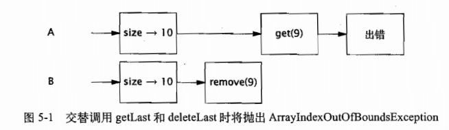

第 4章介绍了构造线程安全类时采用的一些技术，例如将线程安全性委托给现有的线程安全类。委托是创建线程安全类的一个最有效的策略:只需让现有的线程安全类管理所有的状态即可。
Java 平台类库包含了丰富的并发基础构建模块，例如线程安全的容器类以及各种用于协调多个相互协作的线程控制流的同步工具类 (Synchronizer)。本章将介绍其中一些最有用的并发构建模块，特别是在 Java 5.0 和 Java 6 中引的一些新模块，以及在使用这些模块来构造并发应用程序时的一些常用模式。
5.1 同步容器类
同步容器类包括 Vector 和 Hashtable，二者是早期JDK 的一部分，此外还包括在JDK 1.2中添加的一些功能相似的类，这些同步的封装器类是由 Collections.synchronizedXxx等工厂方法创建的。这些类实现线程安全的方式是:将它们的状态封装起来，并对每个公有方法都进行同步，使得每次只有一个线程能访问容器的状态。
5.1.1 同步容器类的问题
同步容器类都是线程安全的，但在某些情况下可能需要额外的客户端加锁来保护复合操作。容器上常见的复合操作包括: 迭代(反复访问元素，直到遍历完容器中所有元素)、跳转(根据指定顺序找到当前元素的下一个元素)以及条件运算，例如“若没有则添加”(检查在Map 中是否存在键值 K，如果没有，就加入二元组(KV))。在同步容器类中，这些复合操作在没有客户端加锁的情况下仍然是线程安全的，但当其他线程并发地修改容器时，它们可能会表现出意料之外的行为。
程序清单5-1 给出了在 Vector 中定义的两个方法:getLast 和 deleteLast，它们都会执行“先检查再运行”操作。每个方法首先都获得数组的大小，然后通过结果来获取或删除最后一个元素。
程序清单 5-1 Vector上可能导致混乱结果的复合操作
public static bject getLast(Vector list) [int lastIndex = list.size() - 1;return list.get(lastIndex);
public static void deleteLast(Vector list)
int lastIndex = listsize() - 1;list,remove(lastIndex);
这些方法看似没有任何问题，从某种程度上来看也确实如此一一无论多少个线程同时调用它们，也不破坏 Vector。但从这些方法的调用者角度来看，情况就不同了。如果线程 A 在包含10个元素的 Vector 上调用getLast，同时线程B在同一个 Vector 上调用deleteLast，这些操作的交替执行如图5-1所示，getLast 将抛出ArrayIndexOutOfBoundsException 异常。在调用size与调用 getLast 这两个操作之间，Vector 变小了，因此在调用 size 时得到的索引值将不再有效这种情况很好地遵循了 Vector 的规范一一如果请求一个不存在的元素，那么将抛出一个异常。但这并不是 getLast 的用者所希得到的结果(即使在并发修改的情况下也不希望看到)，除非 Vector 从一开始就是空的。

由于同步容器类要遵守同步策略，即支持客户端加锁9，因此可能会创建一些新的操作，只要我们知道应该使用哪一个锁，那么这些新操作就与容器的其他操作一样都是原子操作。同步容器类通过其自身的锁来保护它的每个方法。通过获得容器类的锁，我们可以使 getLast 和deleteLast 成为原子操作，并确保 Vector 的大小在调用 size 和 get 之间不会发生变化，如程序清单5-2 所示。
程序清单5-2 在使用客户端加锁的 Vector 上的复合操作
public static Object getLast(Vector list) [synchronized (list)(
int lastIndex = list.size() - 1;return list .get(lastIndex);
public static void deleteLast(Vector list) (synchronized (list) (
int lastIndex = li忌st.size() - 1;list .remove(lastIndex);
在调用 size 和相应的 get之间，Vector 的长度可能会发生变化，这种风险在对 Vector 中的元素进行迭代时仍然会出现，如程序清单5-3 所
程序清单5-3 可能抛出ArraylndexOutOfBoundsException 的迭代操作
for (int i = 0; i < vector.size(); i++)doSomething(vector.get(i));
这种迭代操作的正确性要依赖于运气，即在调用size 和get 之间没有线会修改 Vector.在单线程环境中，这种假设完全成立，但在有其他线程并发地修改 Vector 时，则可能导致麻烦。与getLast一样，如果在对 Vector 进行选代时，另一个线程删除了一个元素，并且这两个操作交替执行，那么这种迭代方法将抛出ArrayIndexOutOfBoundsException异常。
虽然在程序清单5-3 的迭代操作中可能抛出异常，但并不意味着 Vector 就不是线程安全的。Vector 的状态仍然是有效的，而抛出的异常也与其规范保持一致。然而，像在读取最后一个元素或者迭代等这样的简单操作中抛出异常显然不是人们所期望的
我们可以通过在客户端加锁来解决不可靠迭代的问题，但要牺性一些伸缩性。通过在迭代期间持有 Vector 的锁，可以防止其他线程在选代期间修改 Vector，如程序清单5-4所示。然而这同样会导致其他线程在迭代期间无法访问它，因此降低了并发性
程序清单5-4带有客户端加锁的送代
synchronized (vector) for (int i = 0; i < vector.size(); i++)doSomething(vector .get (i));
5.1.2迭代器与 ConcurrentModificationException
为了将问题阐述清楚，我们使用了 Vector，虽然这是一个“古老”的容器类。然而，许多“现代”的容器类也并没有消除复合操作中的问题。无论在直接迭代还是在 Java 5.0人的for-each 循环语法中，对容器类进行选代的标准方式都是使用Iterator。然而，如果有其他线程并发地修改容器，那么即使是使用迭代器也无法避免在迭代期间对容器加锁。在设计同步容器类的迭代器时并没有考虑到并发修改的问题，并且它们表现出的行为是“及时失败”(fail-fast)的。这意味着，当它们发现容器在迭代过程中被修改时，就会抛出一个ConcurrentModificationException 异常。
这种“及时失败”的迭代器并不是一种完备的处理机制，而只是“善意地”捕获并发错误，因此只能作为并发问题的预警指示器。它们采用的实现方式是，将计数器的变化与容器关联起来:如果在迭代期间计数器被修改，那么hasNext 或next将抛出ConcurrentModificationException。然而，这种检查是在没有同步的情况下进行的，因此可能会看到失效的计数值，而迭代器可能并没有意识到已经发生了修改。这是一种设计上的权衡，从而降低并发修改操作的检测代码9对程序性能带来的影响。程序清单5-5 说明了如何使用 for-each 循环语法对 List 容器进行选代。从内部来看，javac将生成使用 Iterator 的代码，反复调用 hasNext 和 next来选代 List 对象。与代 Vector一样要想避免出现 ConcurrentModificationException ，就必须在选代过程持有容器的锁。
程序清单5-5 通过 lterator 来迭代 List
List<Widget> widgetList= Collections.synchronizedList(new ArrayList<Widget>());
..
// 可能抛出 ConcurrentModificationExceptionfor (Widget w : widgetList)
doSomething(w);
然而，有时候开发人员并不希望在迭代期间对容器加锁。例如，某些线程在可以访问容器之前，必须等待迭代过程结束，如果容器的规模很大，或者在每个元素上执行操作的时间很长，那么这些线程将长时间等待。同样，如果容器像程序清单 5-4 中那样加锁，那么在调用doSomething时将持有一个锁，这可能会产生死锁(请参见第 10章)。即使不存在饿或者死锁等风险，长时间地对容器加锁也会降低程序的可伸缩性。持有锁的时间越长，那么在锁上的竞争就可能越激烈，如果许多线程都在等待锁被释放，那么将极大地降低吞吐量和 CPU 的利用率(请参见第11 章)。
如果不希望在迭代期间对容器加锁，那么一种替代方法就是“克隆”容器，并在副本上进行迭代。由于副本被封闭在线程内，因此其他线程不会在选代期间对其进行修改，这样就避免了抛出ConcurrentModificationException(在克隆过程中仍然需要对容器加锁)。在克隆容器时存在显著的性能开销。这种方式的好坏取决于多个因素，包括容器的大小，在每个元素上执行的工作，迭代操作相对于容器其他操作的调用频率，以及在响应时间和吞吐量等方面的需求
5.1.3隐藏迭代器
虽然加锁可以防止迭代器抛出 ConcurrentModificationException，但你必须要记住在所有对共享容器进行迭代的地方都需要加锁。实际情况要更加复杂，因为在某些情况下，迭代器会隐藏起来，如程序清单5-6中的 HiddenIterator 所示。在 Hiddenlterator 中没有显式的选代操作但在粗体标出的代码中将执行迭代操作。编译器将字符串的连接操作转换为调用 StringBuilderappend(Object)，而这个方法又会调用容器的 toString 方法，标准容器的 toString 方法将选代容器，并在每个元素上调用 toString来生成容器内容的格式化表示。
程序清单 5-6 隐在符串连接中的代操作《不要这么做)
public class HiddenIterator @GuardedBy(uthisn)
private final Set<Integer> set = new HashSet<Integer>();
public synchronized void add(Integer i) set.add(i);)public synchronized void remove(Integer i) set,remove(i);
public void addTenThings() (
Random r = new Random();for (int i = 0; i < 10; i++)
add(r.nextInt());System.out.println("DBBUG: added ten elements to u + set);
addTenThings 方法可能会抛出 ConcurrentModificationException，因为在生成调试消息的过程中，toString 对容器进行选代。当然，真正的问题在于 HiddenIteracor 不是线程安全的。在使用 println 中的 set 之前必须首先获取 HiddenIterator 的锁，但在调试代码和日志代码中通常会
忽视这个要求。这里得到的教训是，如果状态与保护它的同步代码之间相隔越远，那么开发人员就越容易忘记在访问状态时使用正确的同步。如果 HiddenIterator 用 synchronizedSet 来包装 HashSet.并且对同步代码进行封装，那么就不会发生这种错误。
正如封装对象的状态有助于维持不变性条件一样，封装对象的同步机制同样有助于确保实施同步策略。
容器的 hashCode 和 equals 等方法也会间接地执行迭代操作，当容器作为另一个容器的元素或键值时，就会出现这种情况。同样，containsAll、reioveAll和 retainAl1等方法，以及把容器作为参数的构造函数，都会对容器进行迭代。所有这些间接的迭代操作都可能抛出 ConcurrentModificationException.
5.2并发容器
Java 5.0 提供了多种并发容器类来改进同步容器的性能。同步容器将所有对容器状态的访问都串行化，以实现它们的线程安全性。这种方法的代价是严重降低并发性，当多个线程竞争
容器的锁时，吞吐量将严重减低。
另一方面，并发容器是针对多个线程并发访问设计的。在Java 5.0 中增加了 ConcurrentHashMap，用来替代同步且基于散列的 Map，以及 CopyOnWriteArrayList，用于在遍历操作为主要操作的情况下代替同步的 List。在新的 ConcurrentMap 接口中增加了对-些常见复合操作的支持，例如“若没有则添加”、替换以及有条件删除等。
通过并发容器来代替同步容器，可以极大地提高伸缩性并降低风险
Java 5.0 增加了两种新的容器类型:Queue 和 BlockingQueue。Queue 用来临时保存一组等待处理的元素。它提供了几种实现，包括:ConcurrentLinkedQueue，这是一个传统的先进先出队列，以及 PriorityQueue，这是一个 (非并发的)优先队列。Queue 上的操作不会阻塞，如果队列为空，那么获取元素的操作将返回空值。虽然可以用 List 来模拟 Quue 的行为一一事实上，正是通过 LinkedList 来实现 Queue 的，但还需要一个 Queue 的类，因为它能去掉 List的随
机访问需求，从而实现更高效的并发。BlockingQueue 扩展了 Queue，增加了可阻塞的插入和获取等操作。如果队列为空，那么获取元素的操作将一直阻塞，直到队列中出现一个可用的元素。如果队列已满(对于有界队列来说)，那么插入元素的操作将一直阻寒，直到队列中出现可用的空间。在“生产者 - 消费者这种设计模式中，阻塞队列是非常有用的，5.3 节将会详细介绍。正如 ConcurrentHashMap 用千代替基于散列的同步Map，Java 6引入了ConcurrentSkipListMap 和 ConcurrentSkipListSet，分别作为同步的SortedMap 和 SortedSet 的并发替代品(例如用 synchronizedMap 包装的 TreeMap 或 TreeSet)
5.2.1 ConcurrentHashMap
同步容器类在执行每个操作期间都持有一个锁。在一些操作中，例如 HashMap.get 或 List.contains，可能包含大量的工作:当遍历散列桶或链表来查某个特定的对象时，必须在许多元素上调用equals(而equals 本身还包含一定的计算量)。在基于散列的容器中，如果 hashCode不能很均匀地分布散列值，那么容器中的元素就不会均匀地分布在整个容器中。某些情况下,某个糟糕的散列函数还会把一个散列表变成线性链表。当遍历很长的链表并且在某些或者全部元素上调用 equals 方法时，会花费很长的时间，而其他线程在这段时间内都不能访问该容器。与HashMap 一样，ConcurrentHashMap 也是一个基于散列的 Map，但它使用了一种完全不司的加锁策略来提供更高的并发性和伸缩性。ConcurrentHashMap 并不是将每个方法都在同一个锁上同步并使得每次只能有一个线程访问容器，而是使用一种粒度更细的加锁机制来实现更大程度的共享，这种机制称为分段锁(Lock Striping，请参见11..3 节)。在这种机制中，任意数量的读取线程可以并发地访问 Map，执行读取操作的线程和执行写入操作的线程可以并发地访问 Map，并且一定数量的写入线程可以并发地修改 Map。ConcurrentHashMap 带来的结果是在并发访问环境下将实现更高的吞吐量，而在单线程环境中只损失非常小的性能。ConcurrentHashMap 与其他并发容器一起增强了同步容器类:它们提供的选代器不会抛出ConcurrentModificationException，因此不需要在迭代过程中对容器加锁。ConcurrenHashMar返回的选代器具有弱一致性(Weakly Consistent)，而并非“及时失败”。弱一致性的选代器可以容忍并发的修改，当创建迭代器时会遍历已有的元素，并可以(但是不保证)在代器被构造后将修改操作反映给容器。
尽管有这些改进，但仍然有一些需要权衡的因素。对于一些需要在整个 Map 上进行计算的方法，例如 size 和 isEmpty，这些方法的语义被略微减弱了以反映容器的并发特性。由于 size返回的结果在计算时可能已经过期了，它实际上只是一个估计值，因此允许 size 返回一个近们值而不是一个精确值。虽然这看上去有些令人不安，但事实上 sie 和 isEmpty 这样的方法在并发环境下的用处很小，因为它们的返回值总在不断变化。因此，这些操作的需求被弱化了，以换取对其他更重要操作的性能优化，包括 get、put、containsKey 和 remove 等。
在ConcurrentHashMap 中没有实现对 Map 加锁以提供独占访问。在Hashtable 和 synchronizedMap 中，获得 Map 的锁能防止其他线程访问这个 Map。在一些不常见的情况中需要这种功能例如通过原子方式添加一些映射，或者对 Map 迭代若干次并在此期间保持元素顺序相同。然而，总体来说这种权衡还是合理的，因为并发容器的内容会持续变化。
与Hashtable和 synchronizedMap 相比，ConcurrentHashMap 有着更多的优势以及更少的劣势因此在大多数情况下，用ConcurrentHashMap 来代替同步 Map 能进一步提高代码的可伸缩性只有当应用程序需要加锁 Map 以进行独占访问时，才应该放弃使用 ConcurrentHashMap。
5.2.2额外的原子 Map 操作
由于ConcurrentHashMap 不能被加锁来执行独占访问，因此我们无法使用客户端加锁来创建新的原子操作，例如 4.4.1节中对 Vector 增加原子操作“若没有则添加”。是，一些常见的复合操作，例如“若没有则添加”“若相等则移除( Remove-If-Equal)”和“若相等则替换(Replace-If-Equal)”等，都已经实现为原子操作并且在 ConcurrentMap 的接口中声明，如程序清单 5-7 所示。如果你需要在现有的同步 Map 中添加这样的能，那么很可能就意味着应该考虑使用 ConcurrentMap了。
程序清单5-7 ConcurrentMap 接口
public interface ConcurrentMap<K,V> extends Map<K,V>// 仅当 K没有相应的映射值时才插入V putIfAbsent (K key， V value);
// 仅当 K 被映射到 V 时才移除
boolean remove(K key, y value);
// 仅当 K被映射到 oldValue 时才替换为 newValueboolean replace(K key， V oldValue， v newValue);
// 仅当 K 被映射到某个值时才替换为 newValue
V replace(K key， V newValue);
5.2.3 CopyOnWriteArrayList
CopyOnWriteArayList 用于替代同步 List，在某些情况下它提供了更好的并发性能，并且在迭代期间不需要对容器进行加锁或复制。(类似地，CopyOnWriteArraySet 的作用是替代同步Set.)
“写入时复制(Copy-On-Write)”容器的线程安全性在于，只要正确地发布一个事实不可变的对象，那么在访问该对象时就不再需要进一步的同步。在每次修改时，都会创建并重新发布一个新的容器副本，从而实现可变性。“写入时复制”容器的迭代器保留一个指向底层基础数组的引用，这个数组当前位于迭代器的起始位置，由于它不会被修改，因此在对其进行同步时只需确保数组内容的可见性。因此，多个线程可以同时对这个容器进行迭代，而不会彼此干扰或者与修改容器的线程相互干扰。“写入时复制”容器返回的迭代器不会抛出ConcurrentModificationException，并且返回的元素与选代器创建时的元素完全一致，而不必考虑之后修改操作所带来的影响。
显然，每当修改容器时都会复制底层数组，这需要一定的开销，特别是当容器的规模较大时。仅当迭代操作远远多于修改操作时，才应该使用“写入时复制”容器。这个准则很好地描述了许多事件通知系统，在分发通知时需要迭代已注册监听器链表，并调用每一个监听器，在大多数情况下，注册和注销事件监听器的操作远少于接收事件通知的操作。(关于“写入时复制”的更多信息请参见[CPJ 2.4.4]。
5.3阻塞队列和生产者-消费者模式
阻塞队列提供了可阻塞的 put 和 take 方法，以及支持定时的 offer 和 poll 方法。如果队列已经满了，那么 put 方法将阻塞直到有空间可用，如果队列为空，那么 take 方法将会阻塞直到有元素可用。队列可以是有界的也可以是无界的，无界队列永远都不会充满，因此无界队列上
的 put 方法也永远不会阻塞。阻塞队列支持生产者 - 消费者这种设计模式。该模式将“找出需要完成的工作”与“执行工作”这两个过程分离开来，并把工作项放入一个“待完成”列表中以便在随后处理，而不是找出后立即处理。生产者 一 消费者模式能简化开发过程，因为它消除了生产者类和消费者类之间的代码依赖性，此外，该模式还将生产数据的过程与使用数据的过程解耦开来以简化工作负载的管理，因为这两个过程在处理数据的速率上有所不同。
在基于阻塞队列构建的生产者 - 消费者设计中，当数据生成时，生产者把数据放入队列，而当消费者准备处理数据时，将从队列中获取数据。生产者不需要知道消费者的标识或数量或者它们是否是唯一的生产者，而只需将数据放入队列即可。同样，消费者也不需要知道生产者是谁，或者工作来自何处。BlockingQueue 简化了生产者- 消费者设计的实现过程，它支持任意数量的生产者和消费者。一种最常见的生产者 - 消费者设计模式就是线程池与工作队列的组合，在 Executor 任务执行框架中就体现了这种模式，这也是第6章和第8章的主题。以两个人洗盘子为例，二者的劳动分工也是一种生产者 - 消费者模式:其中一个人把洗好的盘子放在盘架上，而另一个人从盘架上取出盘子并把它们烘干。在这个示例中，盘架相当于阻塞队列。如果盘架上没有盘子，那么消费者会一直等待，直到有盘子需要烘干。如果盘架放满了，那么生产者会停止清洗直到盘架上有更多的空间。我们可以将这种类比扩展为多个生产者(虽然可能存在对水槽的竞争)和多个消费者，每个工人只需与盘架打交道。人们不需要知道究竟有多少生产者或消费者，或者谁生产了某个指定的工作项。
”“消费”，某费在一不同的能会成为生产者。烘干盘子的工人将“消费”洗干净的湿盘子，而产生烘干的盘子。第三个人把洗干净的盘子整理好，在这种情况中，烘干盘子的工人既是消费者，也是生产者，从而就有了两个共享的工作队列 (每个队列都可能阻塞干工作的运行)。
阻塞队列简化了消费者程序的编码，因为 take 操作会一直阻塞直到有可用的数据。如果生产者不能尽快地产生工作项使消费者保持忙碌，那么消费者就只能一直等待，直到有工作可做。在某些情况下，这种方式是非常合适的(例如，在服务器应用程序中，没有任何客户请求服务)，而在其他一些情况下，这也表示需要调整生产者线程数量和消费者线程数量之间的比率，从而实现更高的资源利用率(例如，在“网页爬虫[Web Crawler]”或其他应用程序中，有无穷的工作需要完成)。
如果生产者生成工作的速率比消费者处理工作的速率快，那么工作项会在队列中累积起来，最终耗尽内存。同样，put 方法的阻塞特性也极大地简化了生产者的编码。如果使用有界队列，那么当队列充满时，生产者将阻塞并且不能继续生成工作，而消费者就有时间来赶上工作处度。
阴塞队列同样提供了一个 offer 方法，如果数据项不能被添加到队列中，那么将返回一个失败状态。这样你就能够创建更多灵活的策略来处理负荷过载的情况，例如减轻负载，将多余的工作项序列化并写入磁盘，减少生产者线程的数量，或者通过某种方式来抑制生产者线程。
在构建高可靠的应用程序时，有界队列是一种强大的资源管理工具，它们能抑制并防止产生过多的工作项，使应用程序在负荷过载的情况下变得更加健壮。
虽然生产者 -消费者模式能够将生产者和消费者的代码彼此解开来，但它们的行为仍然会通过共享工作队列间接地合在一起。开发人员总会假设消费者处理工作的速率能赶上生产者生成工作项的速率，因此通常不会为工作队列的大小设置边界，但这将导致在之后需要重新语计系统架构。因此，应该尽早地通过阻塞队列在设计中构建资源管理机制一一这件事请做得越早，就越容易。在许多情况下，阻塞队列能使这项工作更加简单，如果阻塞队列并不完全符合设计需求，那么还可以通过信号量(Semaphore) 来创建其他的阻塞数据结构(请参见5.5.3 节)在类库中包含了 BlockingQueue 的多种实现，其中，LinkedBlockingQueue 和ArrayBlockingOueue 是 FIFO队列，二者分别与 LinkedList 和ArrayList类似，但比同步 List 拥有更好的并发性能。PriorityBlockingQueue 是一个按优先级排序的队列，当你希望按照某种顺序而不是 FIFO来处理元素时，这个队列将非常有用。正如其他有序的容器一样，PriorityBlockingQueue 既可以根据元素的自然顺序来比较元素(如果它们实现了 Comparable 方法)，也可以使用 Comparator来比较。
最后--个 BlockingQueue 实现是 SynchronousQueue，实际上它不是一个真正的队列，因为它不会为队列中元素维护存储空间。与其他队列不同的是，它维护一组线，这些线在等待着把元素加入或移出队列。如果以洗盘子的比喻为例，那么这就相当于没有盘架，而是将洗好的盘子直接放入下一个空闲的烘干机中。这种实现队列的方式看似很奇，但由于可以直接交付工作，从而降低了将数据从生产者移动到消费者的延迟。(在传统的队列中，在一个工作单元可以交付之前，必须通过审行方式首先完成入列[Enqueue] 或者出列[Dequeue] 等操作。)直接交付方式还会将更多关于任务状态的信息反馈给生产者。当交付被接受时，它就知道消费者已经得到了任务，而不是简单地把任务放人一个队列--这种区别就好比将文件直接交给同事，还是将文件放到她的邮箱中并希望她能尽快拿到文件。因为 SynchronousQueue 没有存功能，因此 put 和 take 会一直阻塞，直到有另一个线程已经准备好参与到交付过程中。仅当有足够多的消费者，并且总是有一个消费者准备好获取交付的工作时，才适合使用同步队列。
5.3.1 示例:桌面搜索
有一种类型的程序适合被分解为生产者和消费者，例如代理程序，它将扫描本地驱动器上的文件并建立索引以便随后进行搜索，类似于某些桌面搜索程序或者 Windows 索引服务。在程序清单5-8 的 DiskCrawler 中给出了一个生产者任务，即在某个文件层次结构中搜索符合索引标准的文件，并将它们的名称放入工作队列。而且，在Indexer 中还给出了一个消费者任务即从队列中取出文件名称并对它们建立索引。
程序清单 5-8 桌面搜索应用程序中的生产者任务和消费者任务
public class FileCrawler implements Runnable (private final BlockingQueue<File> fileQueue;private final FileFilter fileFilter;
private final File root;
..
public void run() (try i
crawl(root);
catch (InterruptedException e) Thread.currentThread() .interrupt ();
private void crawl(File root) throws InterruptedException(File[l entries = root.listFiles (fileFilter);if (entries != null)for (File entry : entries)if (entry.isDirectory())crawl(entry);else if (!alreadyIndexed(entry))fileQueue .put(entry);
public class Indexer implements Runnable (private final BlockingQueue<File> queue;
public Indexer(BlockingQueue<File> queue) [this.queue = queue;
public void run()(
try i
while (true)
indexFile(queue.take());
catch (InterruptedException.e) 
Thread.currentThread().interrupt ();
生产者 - 消费者模式提供了一种适合线程的方法将桌面搜索问题分解为更简单的组件。将文件遍历与建立索引等功能分解为独立的操作，比将所有功能都放到一个操作中实现有着更高的代码可读性和可重用性:每个操作只需完成一个任务，并且阻塞队列将负责所有的控制流因此每个功能的代码都更加简单和清晰。
生产者 -消费者模式同样能带来许多性能优势。生产者和消费者可以并发地执行。如果一个是I/0 密集型，另一个是 CPU 密集型，那么并发执行的吞吐率要高于串行执行的吞吐率。如果生产者和消费者的并行度不同，那么将它们紧密耦合在一起会把整体并行度降低为二者中更
小的并行度。在程序清单 5-9中启动了多个爬虫程序和索引建立程序，每个程序都在各自的线程中运行前面曾讲，消费者线程永远不会退出，因而程序无法终止，第7章将介绍多种技术来解决这个问题。虽然这个示例使用了显式管理的线程，但许多生产者 - 消费者设计也可以通过 Executor任务执行框架来实现，其本身也使用了生产者 - 消费者模式。
程序清单5-9启动桌面搜索
public static void startIndexing(File[] roots) (BlockingQueue<File> queue = new LinkedBlockingQueue<File>(BOUND);FileFilter filter = new FileFilter() (public boolean accept (File file) [ return true; 
for (File root : roots)new Thread(new FileCrawler(queue，filter，root)).start();
for (int i = 0; i < N CONSUMERS; i++)new Thread(new Indexer(queue)).start();
5.3.2串行线程封闭
在javautilconcurrent中实现的各种阻塞队列都包含了足够的内部同步机制，从而安全地将对象从生产者线程发布到消费者线程。
对于可变对象，生产者 - 消费者这种设计与阻塞队列一起，促进了串行线程封闭，从而将对象所有权从生产者交付给消费者。线程封闭对象只能由单个线程拥有，但可以通过安全地发布该对象来“转移”所有权。在转移所有权后，也只有另一个线程能获得这个对象的访问权限，并且发布对象的线程不会再访问它。这种安全的发布确保了对象状态对于新的所有者来说是可见的，并且由于最初的所有者不会再访问它，因此对象将被封闭在新的线程中。新的所有者线程可以对该对象做任意修改，因为它具有独占的访问权。
对象池利用了串行线程封闭，将对象“借给”一个请求线程。只要对象池包含足够的内部同步来安全地发布池中的对象，并且只要客户代码本身不会发布池中的对象，或者在将对象返回给对象池后就不再使用它，那么就可以安全地在线程之间传递所有权。我们也可以使用其他发布机制来传递可变对象的所有权，但必须确保只有一个线程能接受被转移的对象。阻塞队列简化了这项工作。除此之外，还可以通过 ConcurrentMap 的原子方法remove 或者 AtomicReference 的原子方法 compareAndSet 来完成这项工作。
5.3.3 双端队列与工作密取
Java 6增加了两种容器类型，Deque (发音为“deck”)和 BlockingDeque，它们分别对Queue 和 BlockingQueue 进行了扩展。Deque 是一个双端队列，实现了在队列头和队列尾的高效插入和移除。具体实现包括 ArrayDeque和 LinkedBlockingDeque。正如阻塞队列适用于生产者 - 消费者模式，双端队列同样适用于另一种相关模式，即工作密取 (Work Stealing)。在生产者 - 消费者设计中，所有消费者有一个共享的工作队列，而在工作密取设计中，每个消费者都有各自的双端队列。如果一个消费者完成了自己双端队列中的全部工作，那么它可以从其他消费者双端队列末尾秘密地获取工作。密取工作模式比传统的生产者  消费者模式具有更高的可伸缩性，这是因为工作者线程不会在单个共享的任务队列上发生竞争。在大多数时候，它们都只是访问自己的双端队列，从而极大地减少了竞争。当工作者线程需要访问另一个队列时，它会从队列的尾部而不是从头部获取工作，因此进一步降低了队
列上的竞争程度。工作密取非常适用于既是消费者也是生产者问题一一当执行某个工作时可能导致出现更多的工作。例如，在网页爬虫程序中处理一个页面时，通常会发现有更多的页面需要处理。类似的还有许多搜索图的算法，例如在垃圾回收阶段对堆进行标记，都可以通过工作密取机制来实现高效并行。当一个工作线程找到新的任务单元时，它会将其放到自己队列的末尾(或者在工作共享设计模式中，放入其他工作者线程的队列中)。当双端队列为空时，它会在另一个线程的队列队尾查找新的任务，从而确保每个线程都保持忙碌状态。
5.4阻塞方法与中断方法
线程可能会阻塞或暂停执行，原因有多种:等待I/ 操作结束，等待获得一个锁，等待从Thread.sleep 方法中醒来，或是等待另一个线程的计算结果。当线程阻塞时，它通常被挂起并处于某种阻塞状态(BLOCKED、WAITING 或TIMED WAITING)。阻塞操作与执行时间很长的普通操作的差别在于，被阻塞的线程必须等待某个不受它控制的事件发生后才能继续执行，例如等待 I/O 操作完成，等待某个锁变成可用，或者等待外部计算的结束。当某个外部事件发生时，线程被置回 RUNNABLE 状态，并可以再次被调度执行。BlockingQueue 的 put 和 take 等方法会抛出受检查异常 (Checked Exception)InterruptedException，这与类库中其他一些方法的做法相同，例如 Threadsleep。当某方法抛出Interrupted.
Exception 时，表示该方法是一个阻塞方法，如果这个方法被中断，那么它将努力提前结束阻塞状态。
Thread 提供了interrupt 方法，用于中断线程或者查询线程是否已经被中断。每个线程都有
一个布尔类型的属性，表示线程的中断状态，当中断线程时将设置这个状态。中断是一种协作机制。一个线程不能强制其他线程停止正在执行的操作而去执行其他的操作。当线程 A 中断 B 时，A 仅仅是要求 B 在执行到某个可以暂停的地方停止正在执行的操作一一前提是如果线程 B 愿意停止下来。虽然在 API或者语言规范中并没有为中断定义任何特定应用级别的语义，但最常使用中断的情况就是取消某个操作。方法对中断请求的响应度越高，就越容易及时取消那些执行时间很长的操作。
当在代码中调用了一个将抛出 InterruptedException 异常的方法时，你自己的方法也就变成了一个阻塞方法，并且必须要处理对中断的响应。对于库代码来说，有两种基本选择:传递interruptedException。避开这个异常通常是最明智的策略-只需把InterruptedException 传递给方法的调用者。传递InterruptedException的方法包括，根本不捕获该异常，或者捕获该异常，然后在执行某种简单的清理工作后再次抛出这个异常。
恢复中断。有时候不能抛出InterruptedException，例如当代码是 Runnable 的一部分时在这些情况下，必须捕获InterruptedException，并通过调用当前线程上的interrupt 方法恢复中断状态，这样在调用栈中更高层的代码将看到引发了一个中断，如程序清单 5-10 所示
程序清单 5-10 恢复中断状态以避免屏蔽中断
public class TaskRunnable implements Runnable (BlockingQueue<Task> queue;
..
public void run() [
try iprocessTask(c:eue,take());] catch (InterruptedException e) // 恢复被中断的状态Thread,currentThread().interrupt ();
还可以采用一些更复杂的中断处理方法，但上述两种方法已经可以应付大多数情况了。然而在出现InterruptedException 时不应该做的事情是，捕获它但不做出任何响应。这将使调用栈上更高层的代码无法对中断采取处理措施，因为线被中断的证据已经丢失。只有在一种特殊的情况中才能屏蔽中断，即对 Thread 进行扩展，并且能控制调用栈上所有更高层的代码。第7章将进一步介绍取消和中断等操作。
